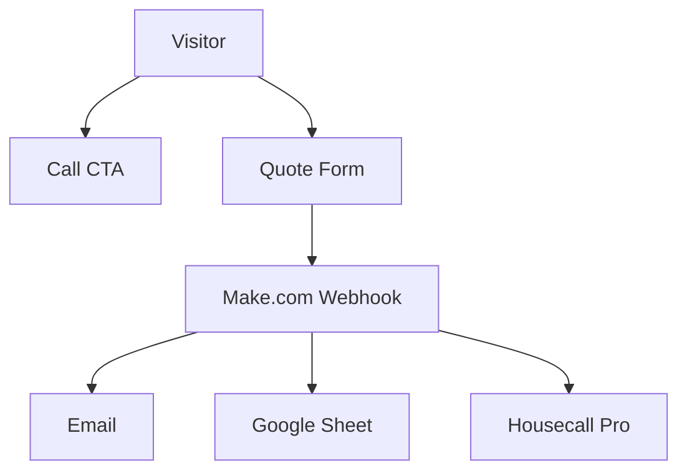

# 911 Cooling Website — Agent Handoff / Project Context

Use this file when continuing work in a **new chat** or with a **new agent**. It summarizes what exists, what is missing, and how the site must be built and styled.

**Owner:** Armando — **Lock In** (company name; site content may still say 911 Cooling until rebrand)  
**Workspace:** `Website/` (Astro + Tailwind, deploy target: Vercel)  
**Inspiration:** [boostmyair.com](https://boostmyair.com/) (conversion funnel), [bizzyac.com/about-us](https://bizzyac.com/about-us/) (About page layout)

---

## Tech stack

| Layer | Choice |
|-------|--------|
| Framework | **Astro 5** + **Tailwind CSS 3** |
| Font | **Source Sans 3** (Google Fonts) |
| Hosting | **Vercel** (GitHub-connected deploys) |
| Form backend | **Make.com** custom webhook → email + Google Sheet + Housecall Pro |
| Env var | `PUBLIC_MAKE_WEBHOOK_URL` (see `.env.example`) |

**Commands:** `npm install` → `npm run dev` (localhost:4321) → `npm run build`

---

## Pages

| Route | File | Purpose |
|-------|------|---------|
| `/` | `src/pages/index.astro` | Main landing / conversion funnel |
| `/about` | `src/pages/about.astro` | About Us (hero, story, stand for, reviews, FAQ, form) |
| `/installations` | `src/pages/installations.astro` | Our Work gallery (separate hero slideshow + photo grid) |

**Header** (`src/components/Header.astro`): fixed, **transparent over hero** → opaque dark bar (`--color-bar-surface`, same as slide-up CTA) on scroll. Logo → `/`. Nav: **Home**, **Our Work** (`/installations`), **About Us**. Phone + Get a Quote + mobile hamburger. Homepage hero secondary CTA: **See Our Work** → `/installations`.

---

## Homepage section order (top → bottom)

1. **Hero** — full-bleed rotating photos (`public/images/hero/`), headline, 3 bullets, **Get a Quote** + **See Our Work** → `/installations`  
   - No slide-up CTA bar on home (installations page still has one)  
2. **Google Reviews** — “Real Stories. Real Comfort.” carousel, auto-advance 10s, **See More Google Reviews** button  
3. **Who We Are** — copy + quote + More About Us; photos below on mobile, left on desktop  
4. **Lead form** — `#quote`, 5 fields → Make.com webhook  
5. **Service areas** — plain text neighborhood list  

**Removed (do not re-add without asking):** Trust Stack (“Why South Florida…”), Comfort Club ($19/mo — **shelved**, data kept in `site.ts` under `comfortClub`).

---

## Installations page (`/installations`)

1. **Hero** — compact slideshow (no CTAs) from `public/images/installations/hero/`  
2. **Gallery grid** — all photos from `public/images/installations/gallery/`  
3. **Slide-up CTA bar** — hidden at top; slides up once user scrolls past ~2 gallery images and **stays visible** (“Like what you see?” + Get a Quote / Call)  

**Two separate photo folders** — hero slideshow does not use gallery files.

---

## About page section order

1. **About Hero** — tall banner, Home / About Us breadcrumb, headline, intro  
2. **Our Story**  
3. **FAQ** — accordion, 4 questions in `site.about.faq`  
4. **Google Reviews** — same component as home, `showGoogleLink`  
5. **Lead form** — same `LeadForm` component  

**Removed:** “What We Stand For” section, “Contact 911 Cooling Today…” CTA panel.

---

## Design system (must follow)

### Colors (from logo — theme TBD for Lock In)

**To change the palette:** follow [`docs/THEME-COLORS.md`](THEME-COLORS.md) (single source of truth for where every color lives).


| Role | Hex | Tailwind / usage |
|------|-----|------------------|
| Emergency / CTA | `#F58220` → `#FFB81C` | `emergency`, `.gradient-emergency` |
| Trust / text | `#0F2C59` | `navy` |
| Cooling tint | `#E0F2FE`, `#A5F3FC` | `ice` |
| Dark sections | `#0c1219` | `.site-dark-band` — **one continuous textured background** for all sections below hero |

### Typography

- Bold, uppercase headings for section titles  
- Clean sans-serif body (Source Sans 3)  
- **Do not** use Bizzy-style yellow slash bars for section labels  

### Section labels (required pattern)

Use **`SectionLabel`** (`src/components/SectionLabel.astro`) or this markup:

```html
<div class="flex items-center gap-3">
  <div class="section-accent-line">  <!-- orange + navy horizontal line -->
    <span></span><span></span>
  </div>
  <p class="text-xs font-bold uppercase tracking-[0.2em] text-white/90">LABEL TEXT</p>
</div>
```

Defined in `src/styles/sections-dark.css` (`.section-accent-line`).

### UI rules

- **Sharper corners** — minimal border-radius (2–6px), not pill/rounded “AI” look  
- **Mobile-first** — hero text centered on mobile; bullets in aligned column  
- **Phone** visible in header, hero, sticky mobile bar, form, footer — don’t over-stack CTAs  
- **Hero → dark band:** no gradient fade (user preference); direct cut is OK  
- **Logo:** `public/logo.png` (wordmark, transparent PNG). Shield-only: `public/logo-shield.png`. Header ~1.5× original logo height  

### Conversion paths (primary)

1. **Tap to call** — `site.phone` / `site.phoneTel`  
2. **Quote form** — `/#quote` on home, `#quote` on about  

---

## Key files map

```
src/data/site.ts              ← ALL copy, phone, areas, reviews, about, FAQ (edit here first)
src/components/
  Header.astro
  Hero.astro
  WhoWeAre.astro / WhoWeArePhotos.astro
  GoogleReviews.astro          ← props: showGoogleLink, showEditNote
  LeadForm.astro
  ServiceAreas.astro
  Footer.astro
  ScrollCtaBar.astro           ← slide-up CTA (home: hero trigger; installations: latched sentinel)
  SectionLabel.astro
  about/AboutHero.astro, AboutStory.astro, AboutStandFor.astro, AboutFaq.astro
  installations/InstallationsHero.astro, InstallationsGallery.astro
src/scripts/
  form-submit.ts               ← quote form validation + POST to Make
  hero-morph.ts                ← hero background crossfade
  reviews-carousel.ts          ← desktop max index = count - 4 visible
  reviews-expand.ts            ← Read more on long reviews
src/styles/
  theme.css, sections-dark.css, header.css, hero-banner.css, google-reviews.css, about-page.css
public/
  logo.png, logo-shield.png
  images/hero/01.png … 04.png   ← homepage hero only
  images/installations/hero/    ← installations page slideshow (best shots)
  images/installations/gallery/ ← full grid; list in site.installations.galleryImages
docs/
  make-scenario.md             ← Make.com setup for Armando
  THEME-COLORS.md              ← where to edit colors / theme swap checklist
  AGENT-HANDOFF.md             ← this file
```

---

## What is done

- [x] Landing page funnel (Boost Air–inspired, simplified)  
- [x] About Us page (Bizzy Air–inspired sections)  
- [x] Dark unified `site-dark-band` with smooth section flow  
- [x] Hero image rotation (full-bleed, not collage grid)  
- [x] Reviews carousel + Read more expand + sample long review  
- [x] Make.com webhook integration (client-side POST)  
- [x] Header nav: Home, About Us; logo links to `/`  
- [x] Installations / Our Work page with separate hero + gallery image folders  
- [x] Header transparent over hero → dark bar surface on scroll (matches slide-up CTA)  
- [x] Google Reviews CTA button (placeholder URL)  
- [x] FAQ accordion on About  
- [x] Logo transparency fix + web-sized PNG  
- [x] `docs/make-scenario.md` for automation setup  

---

## What is still missing (launch blockers / content)

Update **`src/data/site.ts`** when Armando provides:

| Item | Field / location |
|------|------------------|
| Real business phone | `phone`, `phoneTel` |
| FL HVAC license # | `license` |
| Google Business reviews URL | `googleBusinessUrl` |
| Final hero offer line | `diagnosticOffer` (optional in hero now) |
| Own team/truck photos | `public/images/hero/`, `installations/hero/`, `installations/gallery/`, `whoWeAre.photoTop/Bottom` |
| Make.com webhook URL in Vercel | `PUBLIC_MAKE_WEBHOOK_URL` |
| Domain DNS → Vercel | user’s registrar |
| Confirm Housecall Pro module in Make works | `docs/make-scenario.md` |

### Nice-to-have (not built)

- [ ] Comfort Club section (**shelved** — `$19/mo` concept in `site.comfortClub`, component deleted)  
- [ ] City-specific landing pages (Boost-style suburb SEO)  
- [ ] Live embedded Google review widget (currently static cards)  
- [ ] Google Analytics / CallRail  
- [ ] Compress `logo.png` further if LCP slow (was ~200KB after crop)  
- [ ] Favicon could stay as shield; wordmark is large for favicon  

---

## Integrations

### Make.com

- Form sends JSON: `first_name`, `last_name`, `phone`, `email`, `details`, `source`, `page_url`, `submitted_at`  
- Scenario: Webhook → Email → Google Sheets → Housecall Pro (+ error email on HCP fail)  
- Full steps: **`docs/make-scenario.md`**

### Do not

- Hard-code webhook URL in repo (use env var only)  
- Edit the plan file in `.cursor/plans/` unless user asks  
- Re-introduce Comfort Club without explicit request  
- Use yellow slash accents (Bizzy style) for section labels — use orange/navy line instead  

---

## Homepage flow (mermaid)



---

## Notes from product conversations

- Target: distressed South Florida homeowners, 24/7 emergency positioning  
- Simpler than Boost: ~60% less filler; two actions only (call + quote)  
- User is not very technical — prefer editing `site.ts` and README over scattered files  
- npm may not be in PATH in some Cursor sandbox environments; user runs locally  
- Attached images in chat may arrive as **JPEG renamed .png** — prefer files from **Downloads** or direct drop into `public/`  

---

## Last updated

2026-05-20 — Installations gallery page; homepage hero “See Our Work”; Comfort Club shelved.
